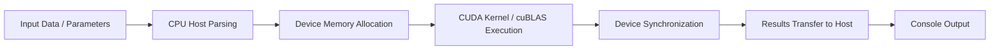

<h1 align="center">Fluxion</h1>

<p align="center">
  High-performance CUDA-based quantitative finance workloads for order book analytics, Monte Carlo simulation, and covariance computation.
</p>

<p align="center">
  
  
  
</p>

---

## Table of Contents

- [Overview](#overview)
- [Architecture](#architecture)
- [Features](#features)
- [Repository Structure](#repository-structure)
- [Prerequisites](#prerequisites)
- [Build](#build)
- [Run](#run)
  - [Order Book Analytics](#order-book-analytics)
  - [Monte Carlo Simulation](#monte-carlo-simulation)
  - [Covariance Matrix Computation](#covariance-matrix-computation)
- [Input Data Format](#input-data-format)
- [Performance Notes](#performance-notes)
- [Troubleshooting](#troubleshooting)
- [Roadmap Ideas](#roadmap-ideas)
- [License](#license)

---

## Overview

Fluxion is a CUDA-accelerated application set for core quantitative finance workloads:

1. **Order book analytics**: computes best bid, best ask, and VWAP from level data.
2. **Monte Carlo simulation**: runs a GPU-parallel terminal-price simulation using geometric Brownian motion.
3. **Covariance matrix computation**: uses cuBLAS matrix multiplication to compute a covariance matrix from return series.

The project is organized as multiple executables built from a shared CMake configuration.

---

## Architecture

### System Diagram


### Processing Flow



---

## Features

- CUDA-enabled compute modules with clear executable separation.
- Shared GPU error-checking utility (`gpuCheck`) for CUDA runtime safety.
- cuRAND-based stochastic path generation for Monte Carlo.
- cuBLAS-backed matrix operation for covariance calculation.
- Native C++ market-data streamer for Binance and Alpaca websocket feeds.
- Sample datasets under `sample_data/` for immediate local runs.

---

## Repository Structure

```text
Fluxion/
├── CMakeLists.txt
├── include/
│   ├── covariance.hpp
│   ├── gpu_utils.hpp
│   ├── monte_carlo.hpp
│   └── orderbook.hpp
├── images/
│   └── gpu-cpu-system-diagram.png
├── sample_data/
│   ├── orderbook.csv
│   └── returns.csv
├── src/
│   ├── covariance.cu
│   ├── cuda_orderbook.cu
│   ├── gpu_utils.cu
│   ├── market_feed.cpp
│   └── monte_carlo.cu
└── LICENSE
```

---

## Prerequisites

- NVIDIA GPU with CUDA support.
- CUDA Toolkit installed (including `nvcc`).
- CMake 3.18 or newer.
- C++ compiler with C++17 support.

Fluxion links to:

- `curand` (Monte Carlo executable)
- `cublas` (Covariance executable)
- OpenSSL (live websocket market-data utility)

---

## Build

From the repository root:

```bash
cmake -S . -B build
cmake --build build
```

This generates three executables in the build output:

- `orderbook`
- `montecarlo`
- `covariance`

It also generates:

- `market_feed`

---

## Run

### Order Book Analytics

```bash
./build/orderbook sample_data/orderbook.csv
```

Expected console metrics:

- `Best Bid`
- `Best Ask`
- `VWAP`

If no path is provided, it defaults to:

```text
sample_data/orderbook.csv
```

### Monte Carlo Simulation

```bash
./build/montecarlo
```

Expected console metric:

- `Mean terminal price`

Current implementation simulates `2^20` paths from fixed parameters in code.

### Covariance Matrix Computation

```bash
./build/covariance sample_data/returns.csv
```

Expected console metric:

- confirmation message for computed covariance matrix dimensions

If no path is provided, it defaults to:

```text
sample_data/returns.csv
```

### Live Market Data Streamer

Build and stream Binance top-of-book updates:

```bash
./build/market_feed --exchange binance --symbol BTCUSDT
```

Build and stream Alpaca quote updates:

```bash
ALPACA_API_KEY=... ALPACA_SECRET_KEY=... ./build/market_feed --exchange alpaca --symbol AAPL
```

Optional flags:

- `--symbols AAPL,MSFT,...` for Alpaca multi-symbol subscriptions
- `--alpaca-feed iex|sip` to select the Alpaca feed
- `--count N` to stop after `N` parsed updates

Output format:

```text
[exchange] SYMBOL bid=... ask=... bid_size=... ask_size=...
```

Do not commit API keys to the repository.

---

## Input Data Format

### `sample_data/orderbook.csv`

Whitespace-delimited values per row:

```text
bid ask volume
```

Example:

```text
100.00 100.50 10
100.10 100.60 12
```

### `sample_data/returns.csv`

Whitespace-delimited numeric matrix where:

- each row is an observation,
- each column is a variable/asset return stream.

Example:

```text
0.01 0.02 -0.01 0.00
0.03 -0.02 0.01 0.02
```

---

## Performance Notes

- Keep data on the GPU for larger multi-step workflows when extending modules.
- For bigger datasets, consider multi-block reductions in order book logic.
- Consider pinned host memory and stream-based overlap for transfer/compute optimization.
- Profile with Nsight Systems / Nsight Compute when tuning kernels.

---

## Troubleshooting

- **`Failed to find nvcc` during CMake configure**  
  Install CUDA Toolkit and ensure `nvcc` is discoverable, or set `CUDAToolkit_ROOT`.

- **Linker errors for cuBLAS or cuRAND**  
  Verify CUDA Toolkit installation includes required libraries and that toolkit paths are visible to CMake.

- **No rows loaded from input files**  
  Confirm path correctness and whitespace-delimited numeric format.

---

## Roadmap Ideas

- Command-line argument support for simulation parameters (paths, drift, volatility, horizon).
- Centering/normalization options before covariance computation.
- Benchmark harness and regression/performance tests.
- Optional CSV parser with delimiter configurability.

---

## License

This project is licensed under the MIT License. See [LICENSE](LICENSE) for details.
